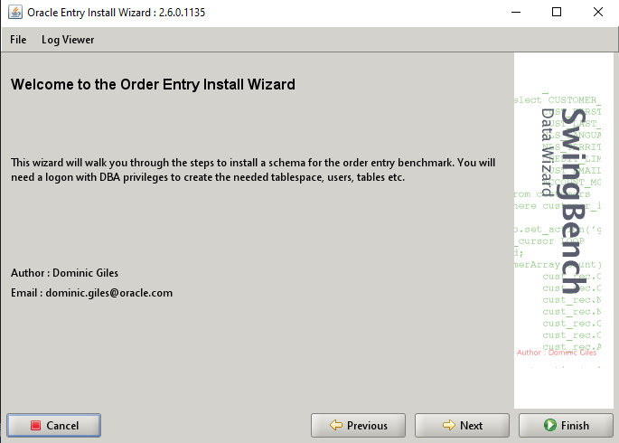
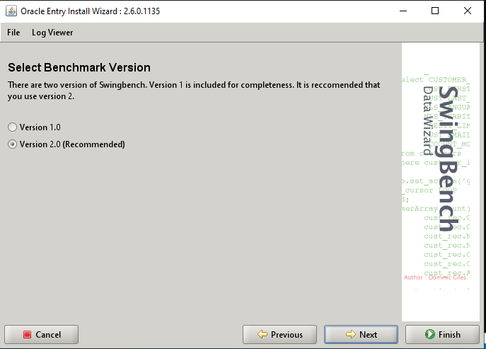
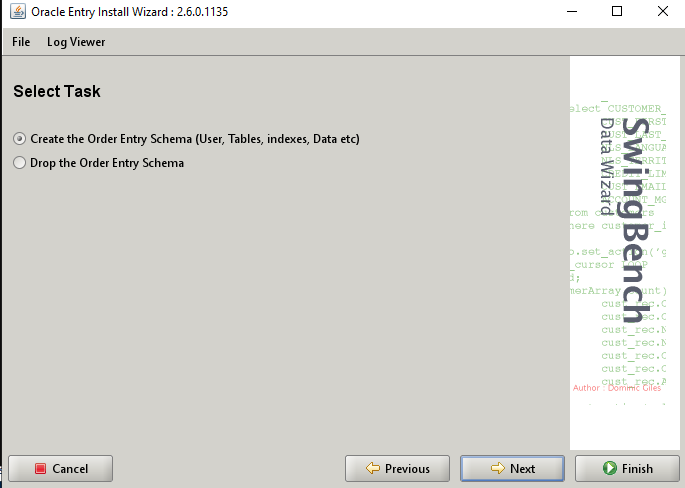
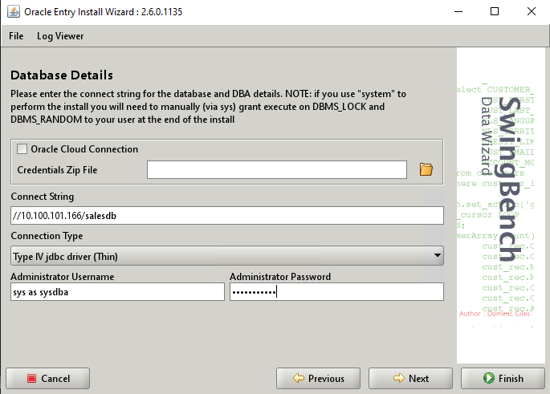
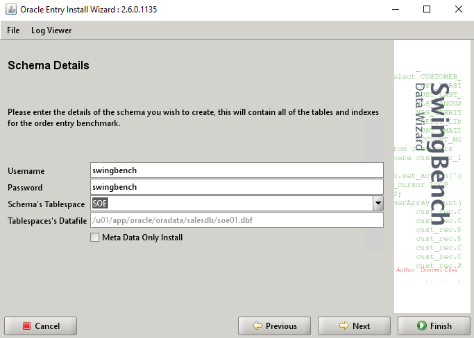
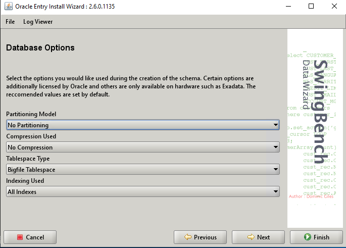
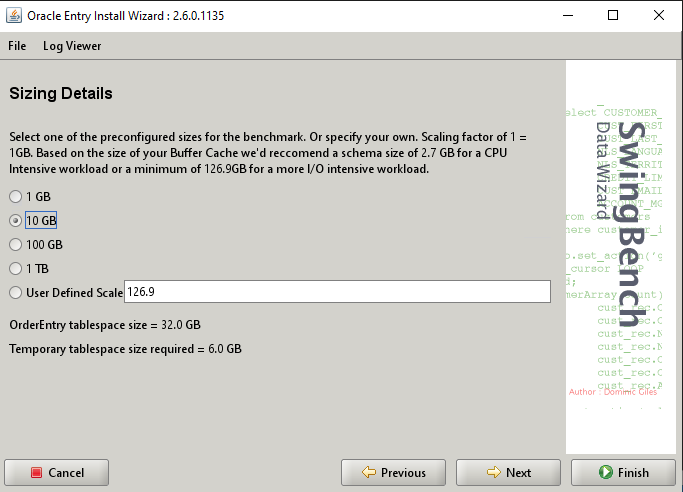
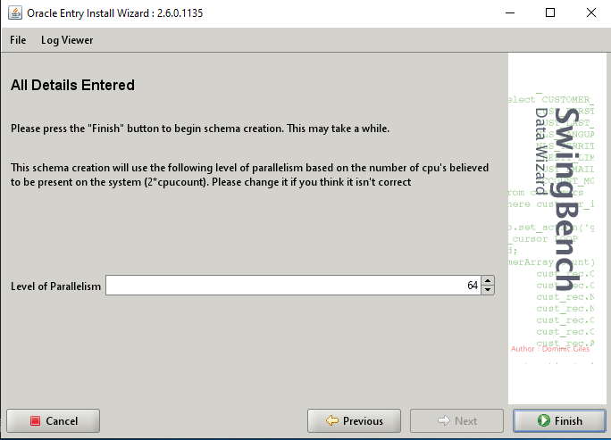

**_SwingBench_**

1. Install SwingBench
   1. Install JRE8

**JVM increase**

1.  C:\swingbench\launcher\launcher.xml

```
sed -i 's/Xmx1024m/Xmx4096m' /mnt/c/swingbench/launcher/launcher.xml
sed -i 's/Xmx2048m/Xmx9172m' /mnt/c/swingbench/launcher/launcher.xml
sed -i 's/Xms512m/Xms2048m' /mnt/c/swingbench/launcher/launcher.xml
```

**Generate Sample SOE Schema**

2.  C:\swingbench\winbin\oewizard.bat

<kbd>  </kbd>
<kbd>  </kbd>
<kbd>  </kbd>

<kbd>  </kbd>
<kbd>  </kbd>
<kbd>  </kbd>

<kbd>  </kbd>
<kbd>  </kbd>

Windows-Swingbench : m5.8xlarge
Oracle Server : m4.16xlarge

20:58
